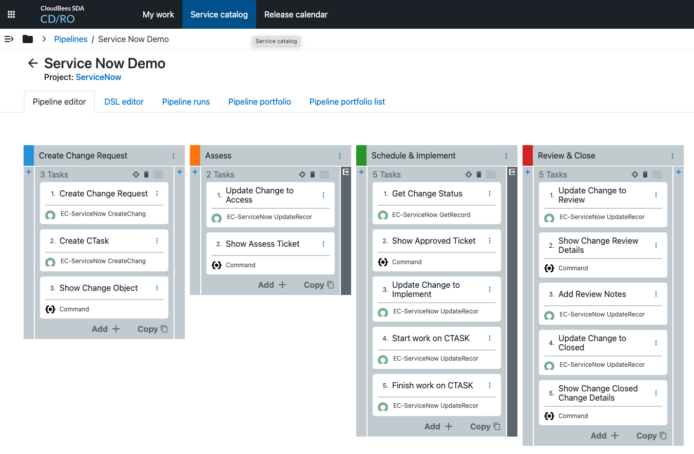

# Service Now Demo

This project creates the artifacts needed to run the Service Now Demo.  To replicated this demo, you will still need a Service Now instance to connect to as well as the CD/RO plugin and a configuration for the CD/RO Service Now plugin to connect to that Service Now instance.

